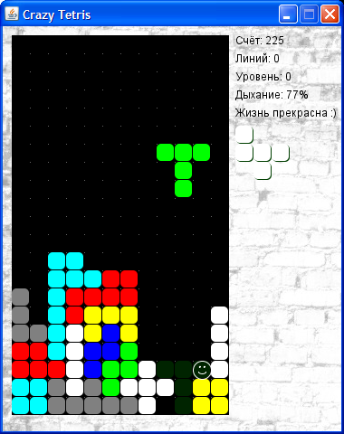
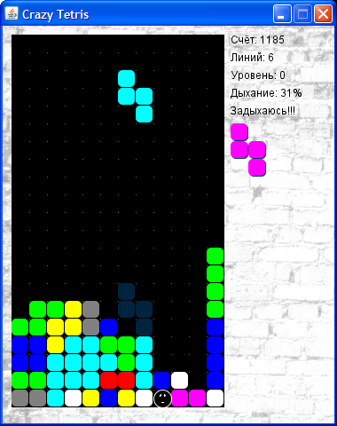

Crazy Tetris for Java 8
===========

* [In Russian](README_RU.md)
* [Vaadin version](vaadin-tetris/README.md)
* Support pages: [forum](http://tv-games.ru/forum/blog.php?b=2034), [development diary](http://tv-games.ru/forum/showthread.php?t=5661), [business card site](http://leonis.tv-games.ru/crazytetris).

Description
--------
The game is a variation on the theme of the legendary `Tetris`.

Created based on the eponymous game for DOS (author unknown).

The plot is classic - you need to stack rows of bricks without gaps.
Full lines in the glass are cleared, and the score increases.

 

Rules of the game
-----------------
* An original character lives in this game world, try not to crush him with a heavy block. 
It can also suffocate in a confined space.
* The game has two modes. Normal - all figures are made up of 4 parts, and crazy - 
the size of the figures varies from 1 to 5.
* To score points faster - clear several rows of bricks at once.
* Levels (and speed) increase every 10,000 points. Theoretically, you can achieve in the region of 100,000,
however, it will not be easy.

Control
----------
* Four `arrow` keys, `space` bar, `P` key to pause. `F12`: next level.
* If you are too lazy to use the mouse, then the navigation in the windows is as follows: select with the "`Tab`" key; "`space`" to confirm.

Launch
------
File `CrazyTetris.bat`

In this case, [Java Runtime Environment (JRE)](http://www.oracle.com/technetwork/java/javase/downloads/index.html) version 8 or higher must be correctly installed.

Copyright
---------------
I respect the rights of `Tetris Holding` to the` Tetris` trademark (® & © 1985 ~ 2019). The word `Tetris` in the name is used for historical reasons.
This was the name of the game for DOS, a remake made on its basis.

The game sounds the melody "Korobeiniki" from the album "`A Tribute to the Music of Tetris: Traditional`", authored by `Brado Popcorn`.
It was honestly bought. [Here is his website](http://bradopopcorn.bandcamp.com/album/a-tribute-to-the-music-of-tetris-traditional).
There you can buy your own copy of the melody if you decide to leave the game.
If you want a different version of the melody, then [look for the Korobeiniki tracks here](http://muzlishko.ru/mp3/%D0%9A%D0%BE%D1%80%D0%BE%D0%B1%D0%B5%D0%B9%D0%BD%D0%B8%D0%BA%D0%B8%20(%20Remix%20).

To play MP3 music, is used `BasicPlayer` library from` JavaZOOM`.

Download
--------
* [Crazy Tetris 1.2.0](/doc/maven/CrazyTetris.zip)
* [Source Code](https://github.com/LeonisX/crazy-tetris)

Changelog
----------------

* 1.2.0 (12.09.2019). Separation of UI and game code.
* 1.1.5 (09.08.2019). Internalization, sound, performance optimization.
* 1.1.0 (07.08.2019). Version for Vaadin. The game engine is more versatile. Minor bugs fixed.
* 1.0.6 (05.08.2019). The game engine is now as a separate module.
* 1.0.5 (05.08.2019). Generate more varied colors.
* 1.0.4 (05.08.2019). Full code refactor. The game engine is now separate from resources and the GUI.
* 1.0.3 (01.08.2019). Java 8. Code refactoring. Packing resources in a JAR archive. Version and copyright output
* 1.0.2 (14.03.2015). Fully working version

Task list
---------

* Translate the melody to MIDI and trim it normally (need help !!!)
* Implement dynamic resizing of the playing field
* Queues for figures and the next figures
* Various types of gameplay, for example, a partially filled glass, all sorts of bonuses, tasks, etc.

Old versions
--------------

* [Crazy Tetris 1.0.2](/doc/batch/CrazyTetris-src.zip) (manual project build system)
* [Crazy Tetris 1.0.2](/doc/ant/CrazyTetris.zip) (Ant) ([src](/doc/ant/CrazyTetris-src.zip))

How to find me?
===============
* Website http://tv-games.ru (user Leonis)
* e-mail: tv-games@mail.ru
* skype: tivi_leonis

If there are suggestions for the game, or errors are found - write, I will be happy to answer.

Have a nice game :)
