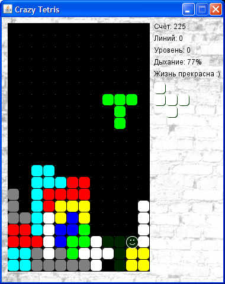
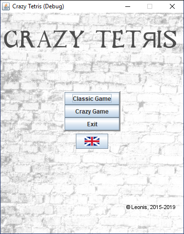

Crazy Tetris для Java 8
===========

* [На английском](README.md)
* [Версия для Vaadin](vaadin-tetris/README_RU.md)
* Страницы поддержки: [форум](http://tv-games.ru/forum/blog.php?b=2034), [дневник разработки](http://tv-games.ru/forum/showthread.php?t=5661), [сайт-визитка](http://leonis.tv-games.ru/crazytetris).

Описание
--------
Игра является вариацией на тему легендарного `Tetris`'a.

Создана по мотивам одноимённой игры для DOS (автор неизвестен).

Сюжет классический - необходимо складывать ряды кирпичиков без промежутков.
Полные строки в стакане очищаются, и при этом счёт увеличивается.

 

Правила игры
------------
* В этом игровом мире живёт самобытный персонаж, постарайтесь не раздавить его
тяжёлым блоком. Так же он может задохнуться в замкнутом пространстве.
* В игре два режима. Обычный - все фигурки состоят из 4 частей, и сумасшедший,
размер фигурок варьируется от 1 до 5.
* Чтобы быстрее набрать очки - очищайте сразу по несколько строк кирпичиков.
* Уровни (и скорость) растут через каждые 10000 очков. Теоретически можно набрать в районе 100000,
однако, это будет непросто.

Управление
----------
* Четыре клавиши `стрелок`, `пробел`, "`p`" для паузы. `F12`: следующий уровень.
* Если лень пользоваться мышкой, то навигация в окнах такая: выбор клавишей "`Tab`"; "`пробел`" для подтверждения.

Запуск
------
Файл `CrazyTetris.bat`
 
При этом должна быть корректно установлена [Java Runtime Environment (JRE)](http://www.oracle.com/technetwork/java/javase/downloads/index.html) версии 8 или выше.

Авторские права
---------------
Я уважаю права `Tetris Holding` на торговую марку `Tetris` (® & © 1985~2019). Слово `Tetris` в названии используется по историческим причинам.
Так называлась игра для DOS, ремейк сделан на её основе. 

В игре звучит мелодия "`Korobeiniki`" из альбома "`A Tribute to the Music of Tetris : Traditional`", за авторством `Brado Popcorn`.
Она была честно куплена. [Вот его сайт](http://bradopopcorn.bandcamp.com/album/a-tribute-to-the-music-of-tetris-traditional).
Там вы можете купить свой экземпляр мелодии, если решите оставить игру у себя.
Если же хочется другой вариант мелодии, то [ищите треки Коробейников тут](http://muzlishko.ru/mp3/%D0%9A%D0%BE%D1%80%D0%BE%D0%B1%D0%B5%D0%B9%D0%BD%D0%B8%D0%BA%D0%B8%20(%20Remix%20).

Для проигрывания MP3 музыки используется `BasicPlayer` от `JavaZOOM`.

Скачать
-------
* [Crazy Tetris 1.2.0](/doc/maven/CrazyTetris.zip)
* [Исходный код](https://github.com/LeonisX/crazy-tetris)

Список изменений
----------------

* 1.2.0 (12.09.2019). Разделение UI и игрового кода.
* 1.1.5 (09.08.2019). Интернализация, звук, оптимизация производительности.
* 1.1.0 (07.08.2019). Версия для Vaadin. Движок игры более универсальный. Исправлены мелкие ошибки.
* 1.0.6 (05.08.2019). Движок игры теперь как отдельный модуль.
* 1.0.5 (05.08.2019). Генерировать более разнообразные цвета.
* 1.0.4 (05.08.2019). Полный рефактор кода. Движок игры теперь отдельно от ресурсов и GUI.
* 1.0.3 (01.08.2019). Java 8. Рефакторинг кода. Упаковка ресурсов в JAR-архив. Вывод версии и копирайта
* 1.0.2 (14.03.2015). Полностью работающая версия 

Список задач
------------

* Перевести мелодию в MIDI и нормально её обрезать (нужна помощь!!!)
* Написать нормальную документацию, перевести на английский
* Реализовать динамическое изменение размеров игрового поля
* Очередь для фигур и следующих фигур
* Различные типы гейиплея, например, частично заполненный стакан, всякие бонусы, задачи, и т.д.

Прежние версии
--------------

* [Crazy Tetris 1.0.2](/doc/batch/CrazyTetris-src.zip) (ручная система сборки проекта)
* [Crazy Tetris 1.0.2](/doc/ant/CrazyTetris.zip) (Ant) ([src](/doc/ant/CrazyTetris-src.zip))

Как меня найти?
===============
* Сайт http://tv-games.ru (пользователь Leonis)
* e-mail: tv-games@mail.ru
* skype: tivi_leonis

Если возникают предложения по игре, или найдены ошибки - пишите, с радостью отвечу.

Приятной игры :)
