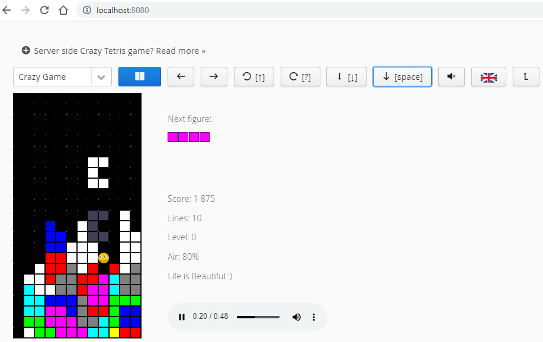

Crazy Tetris для Vaadin
===========

* [Английския версия](README.md)

Этот пример показывает, что `Vaadin` годится не только для создания современных энтерпрайз сайтов, 
но и для создания игр, не требующих высокого FPS, например, `Tetris`. 
В этом примере частота кадров 10, и её можно поднять до 30, отмечая лишь незначительное замедление геймплея.

* Интернализация выполняется в ручном режиме, благо, элементов управления немного.
* Движок свободно поддерживает несколько звуковых каналов.
* Закруглённые края квадратиков слишком сильно нагружали процессор, поэтому они были упрощены.
* Чтобы не усложнять задачу, рекорды хранятся в памяти.

В качестве движка использован ремейк мало известной одноимённой игры для DOS.

Управление
----------
* Четыре клавиши `стрелок`, `пробел`, `P` для паузы, `L` для выбора языка, `S` для звука. `F12`: следующий уровень.
* Если лень пользоваться мышкой, то навигация в окнах такая: выбор клавишей "`Tab`"; "`пробел`" для подтверждения.

Запуск
------
Jetty:

`mvn jetty:run`

http://localhost:8080/

Проект так же успешно тестировался в контейнере `WildFly 17`.

Авторские права
---------------
Я уважаю права `Tetris Holding` на торговую марку `Tetris` (® & © 1985~2019). Слово `Tetris` в названии используется по историческим причинам.
Так называлась игра для DOS, ремейк сделан на её основе. 

В игре звучит мелодия "`Korobeiniki`" из альбома "`A Tribute to the Music of Tetris : Traditional`", за авторством `Brado Popcorn`.
Она была честно куплена. [Вот его сайт](http://bradopopcorn.bandcamp.com/album/a-tribute-to-the-music-of-tetris-traditional).
Там вы можете купить свой экземпляр мелодии, если решите оставить игру у себя.
Если же хочется другой вариант мелодии, то [ищите треки Коробейников тут](http://muzlishko.ru/mp3/%D0%9A%D0%BE%D1%80%D0%BE%D0%B1%D0%B5%D0%B9%D0%BD%D0%B8%D0%BA%D0%B8%20(%20Remix%20).

Смайлики сделаны по образцу с сайта [freepik.com](https://www.freepik.com/free-vector/funny-smileys-collection-flat-design_837327.htm).

Версия для Vaadin сделана по мотивам игры [Vaadin Tetris](https://github.com/samie/VaadinTetris) от Sami Ekblad.

Приятной игры :)
